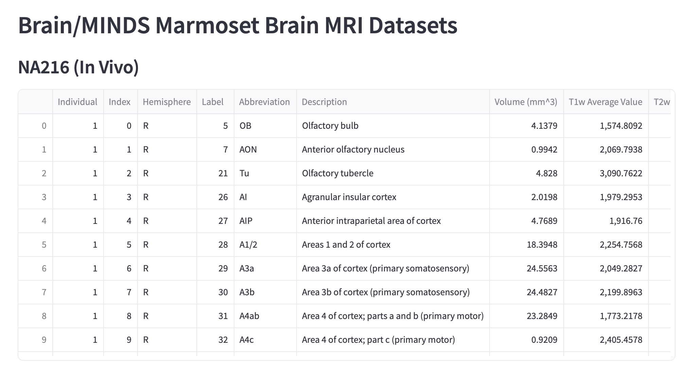

# Dashboard for Brain/MINDS Marmoset Brain MRI Datasets
[Brain/MINDS Marmoset Brain MRI Dataset NA216 (In Vivo) and eNA91 (Ex Vivo)](https://dataportal.brainminds.jp/marmoset-mri-na216)  

Analyze the following files:
- Individual_List: Information of individual animals
- Variables_gm: Averaged variables in individual gray matter regions


## Install
Set up a virtual environment and Jupyter kernel
```
conda create --name=brain python=3.10
conda activate brain
conda install -c anaconda pip

pip install ipykernel
ipython kernel install  --user --name "brain"
```

Install libraries
```
pip install -r requirements.txt
```

Download and extract files
```
bash setup_data.sh
```

## Dashboard
Run the dashboard
```
streamlit run app.py
```

View datasets  


Plot  

